# Git

Download [64-bit Git for Windows Setup](https://git-scm.com/download/win)

Follow these steps:

1. Read the EULA.  
   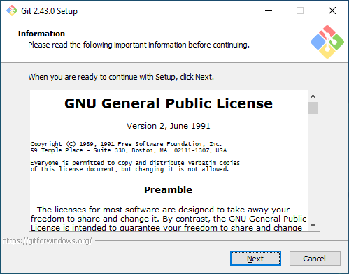

2. Keep the folder default.  
   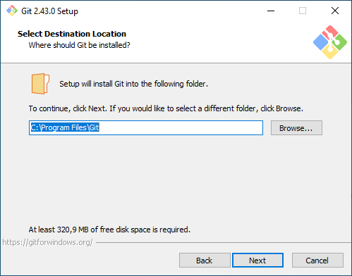

3. Keep everything default.  
   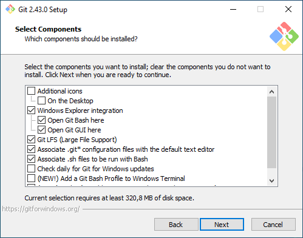
   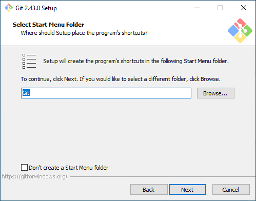

4. Pick Visual Studio Code from the list.  
   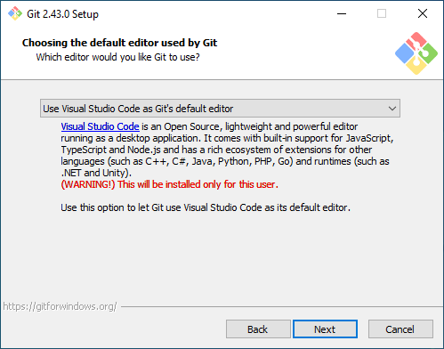

5. Pick the bottom entry.  
   

6. Keep everything default.  
   
   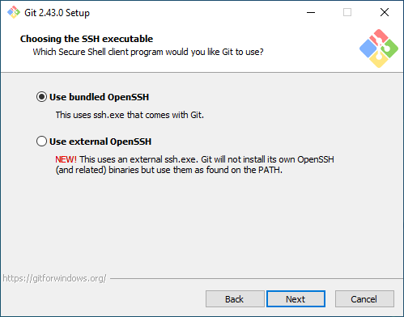
   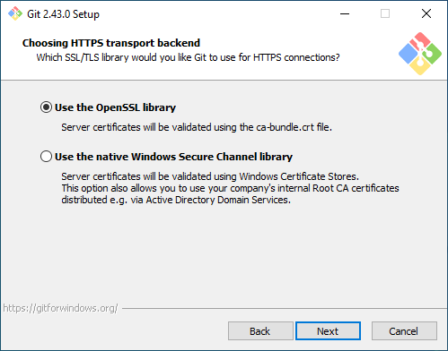
   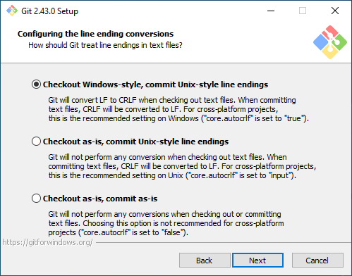
   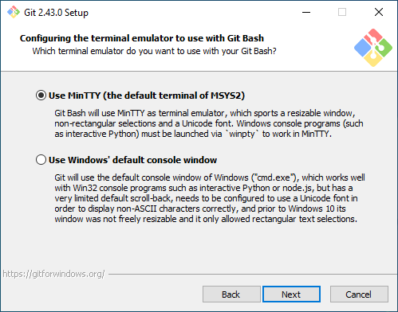
   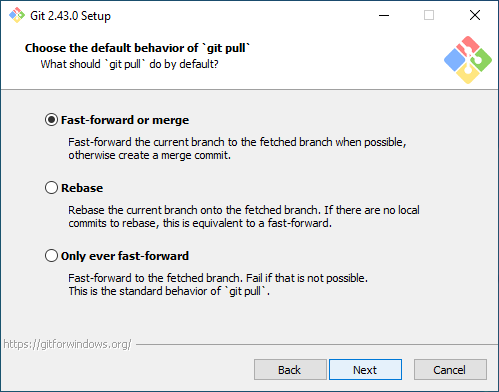
   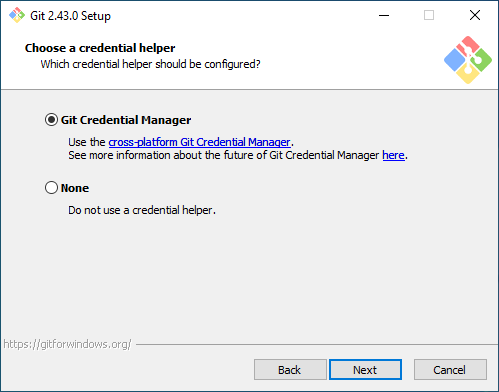
   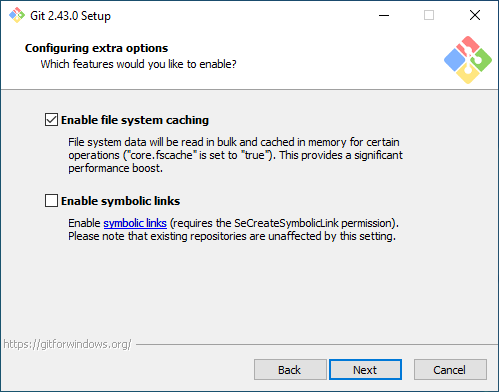
   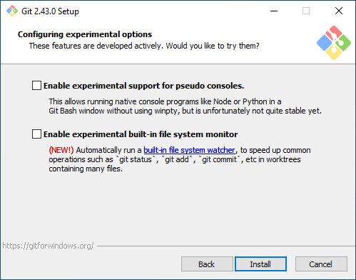

7. Wait until its installed.  
   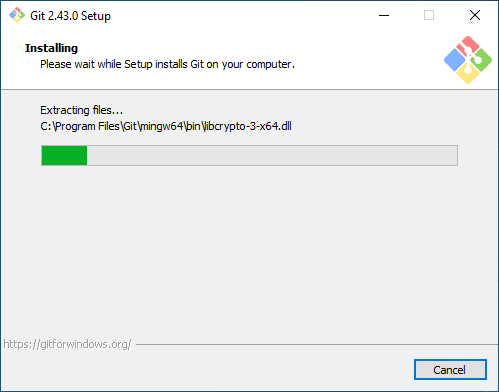

8. Untick all boxes. You're done.  
   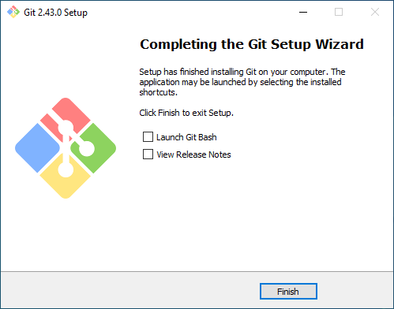
