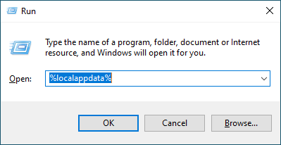
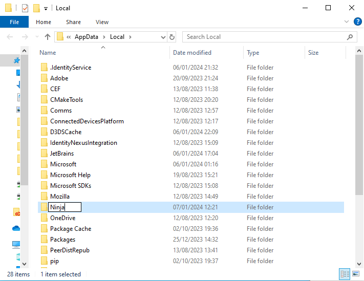
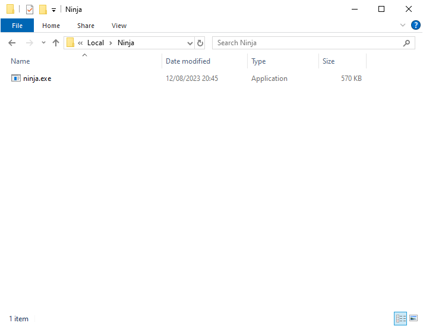
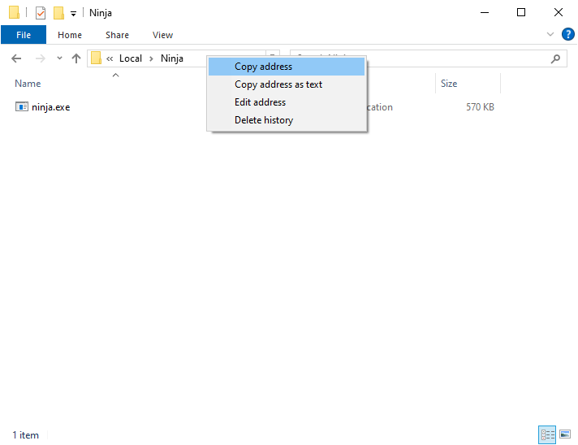
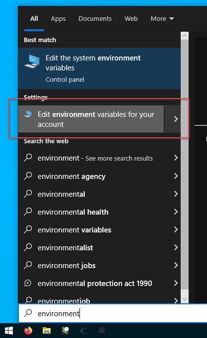
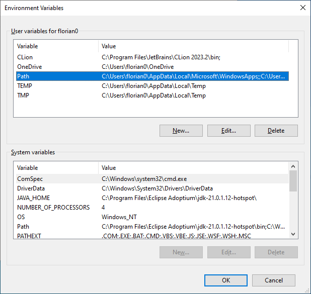
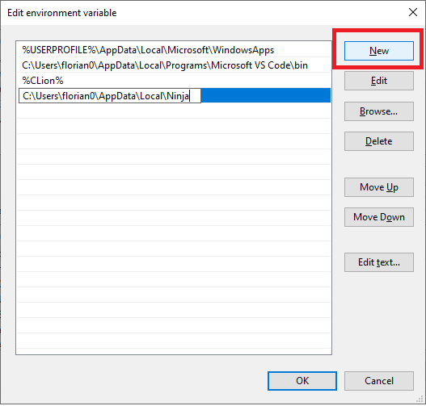

# Ninja build

[Ninja](https://ninja-build.org/) is a build tool just like make, but it's faster.

You can download Ninja here: https://github.com/ninja-build/ninja/releases. Just pick the latest version. You want `ninja-win.zip`.

Ninja has no installer, so we need to install it ourselfes. We can do that, no problem.

1. Press Windows + R to open the run command window.
2. Type `%localappdata%` and press ok.  
   
3. The Explorer opens. Create a folder named Ninja in this location
   
4. Extract `ninja-win.zip` and put the extracted files into that folder.
   
5. Copy the path to this location
   
6. Open the Environment Variables Editor for your account. Don't use the System Variables Editor!
   
7. In the upper part that says "User variables", select `PATH` and click on `Edit`.
   
8. Click on `New` and paste the path you copied.
   
9. Close everything by clicking Ok.

This changes only apply to applications started after this. So if your IDE is already running, you need to restart it. 
A safe bet is always to reboot your computer.
