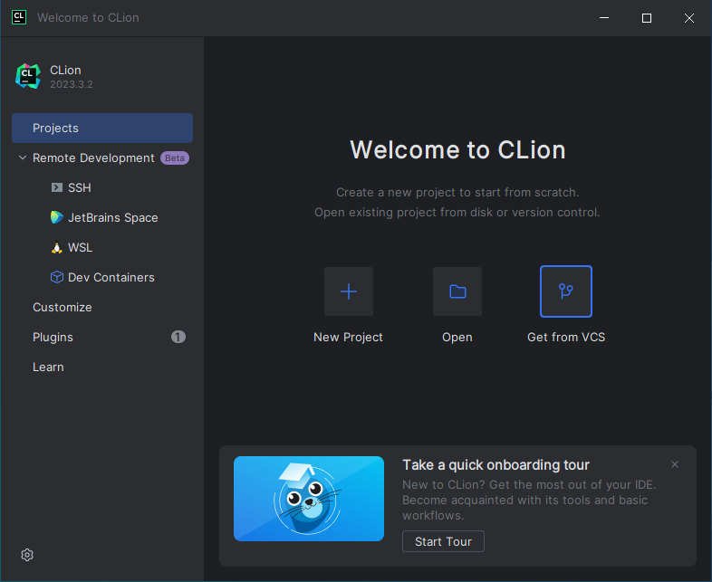
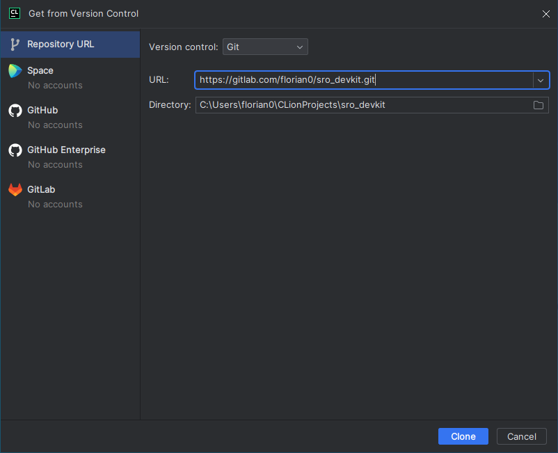
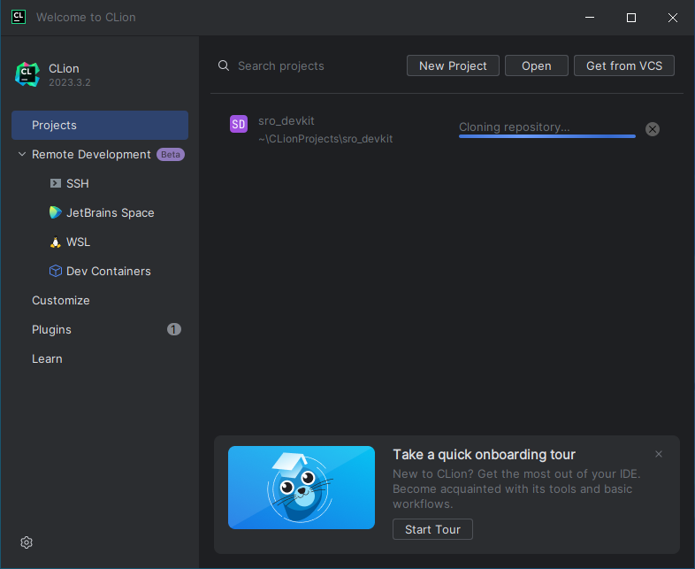
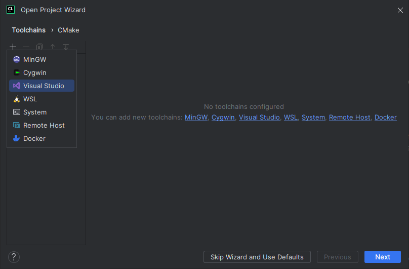
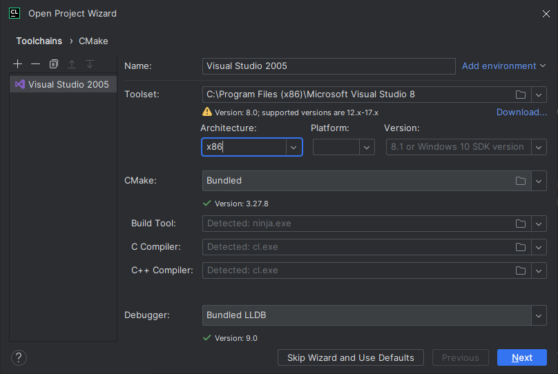
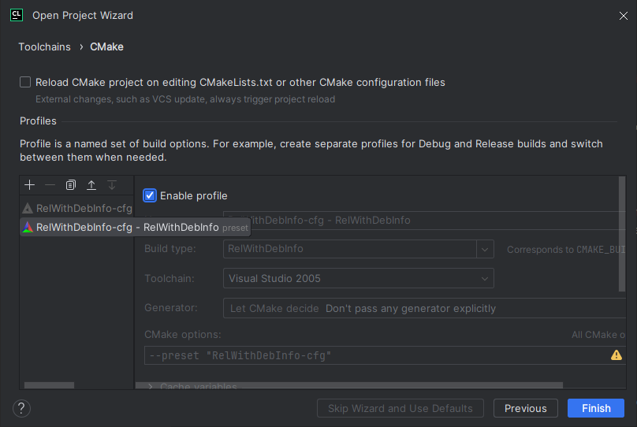
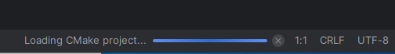
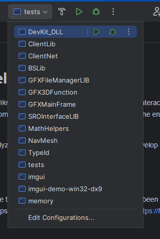
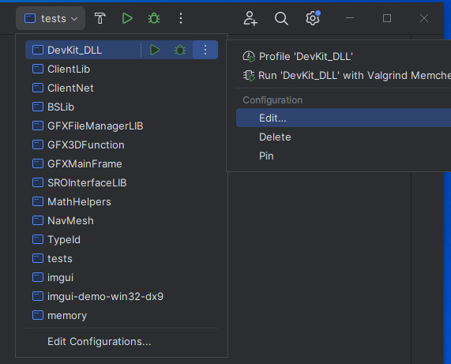
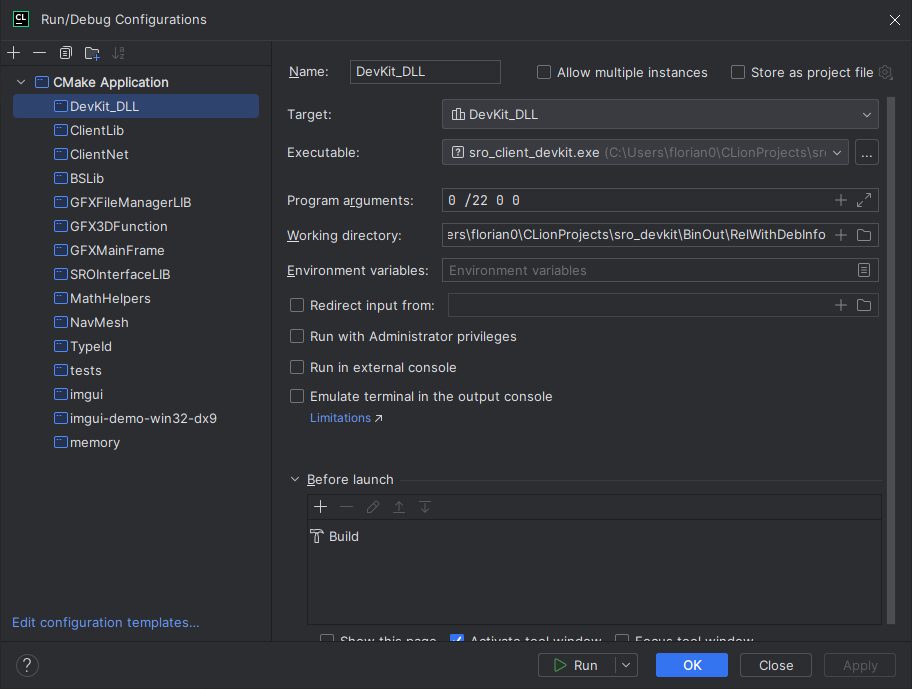

# Jetbrains CLion

!!! tip "Get CLion for free!"
    * You get free access to every EAP (Early Access Program) version released.
    * If you're a student, you get all Jetbrains Products, including CLion, for free.

[https://www.jetbrains.com/clion/buy/#personal](https://www.jetbrains.com/clion/buy/#personal)

If you want to give CLion a try, you can use the 30-days trial. 

## Prequisites

* Follow [this guide](../../required-tools/visual-studio-2005/index.md) to install Visual Studio 2005.
* Follow [this guide](../../required-tools/git/index.md) to install Git.

## Checkout the repository

1. On first start, click *Get from VCS*.  
   

2. Enter `https://gitlab.com/florian0/sro_devkit.git` as URL.  
   

3. Wait for the process to finish.  
   


## Configure the toolchain

In order to add Visual Studio 2005 as a compiler, we need to make a small change so CLion can detect it.

#### Patch Visual Studio 2005

CLion requires the environment variable `%VisualStudioVersion%` to be present. Visual Studio 2005 does not populate this
environment variable, therefore CLion will only state *Not found* when simply adding Visual Studio 2005 as a toolchain.

Change this file `C:\Program Files (x86)\Microsoft Visual Studio 8\VC\vcvarsall.bat` and add in a new line after `@echo off`.

```batch
@set VisualStudioVersion=8.0
```

Note that this instruction has changed from vcvars32.bat. CLion now needs this line in a different file.

### Add Toolchain

CLion will greet you with this dialog. Remove the existing *MinGW* toolchain by pressing the small *-* button. Then 
add a Visual Studio toolchain by clicking on the *+* button.



Make sure to name the toolchain `Visual Studion 2005`. Choose the root path of your Visual Studio install, e.g. 
`C:\Program Files (x86)\Visual Studio 8.0\`

CLion should then properly detect Visual Studio 2005. It will warn you about the version, but that's okay for now.


## Configure the project

On first opening, CLion will ask you to configure a profile. SRO_DevKit comes with a predefined profile.
First of all, delete the automatically created *Debug* profile. It won't work anyways.
Next, enable the *RelWithDebInfo-cfg - RelWithDebInfo* profile. After that click *Finish*.



Wait for configuring complete.



Select DevKit_DLL in the dropdown on the top.




## Run and debug configuration

You need to copy a working client to `BinOut/RelWithDebInfo`.

After that open the run configuration for DevKit_DLL.


Now select the client as executable and write `0 /22 0 0` as arguments. 


Now you can run and debug with CLion.
