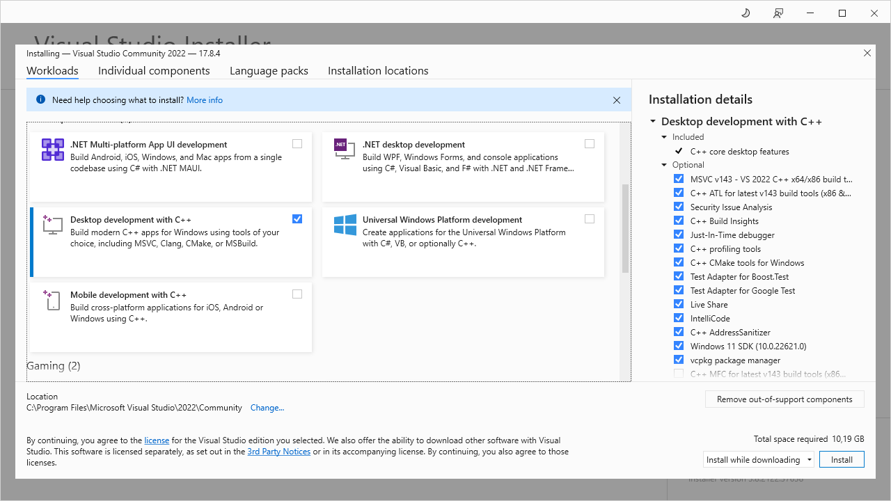
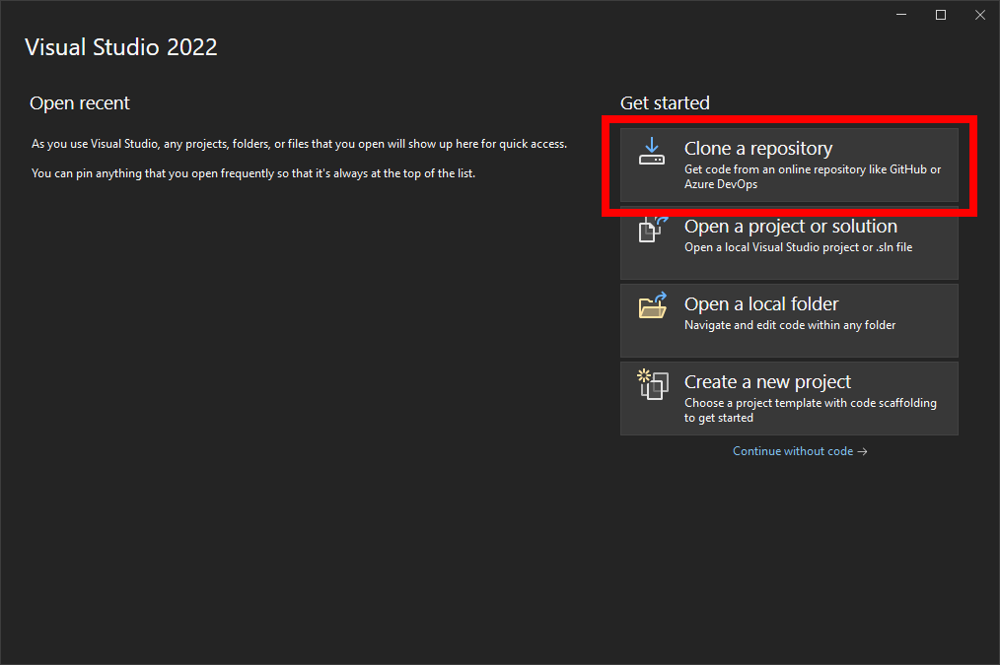
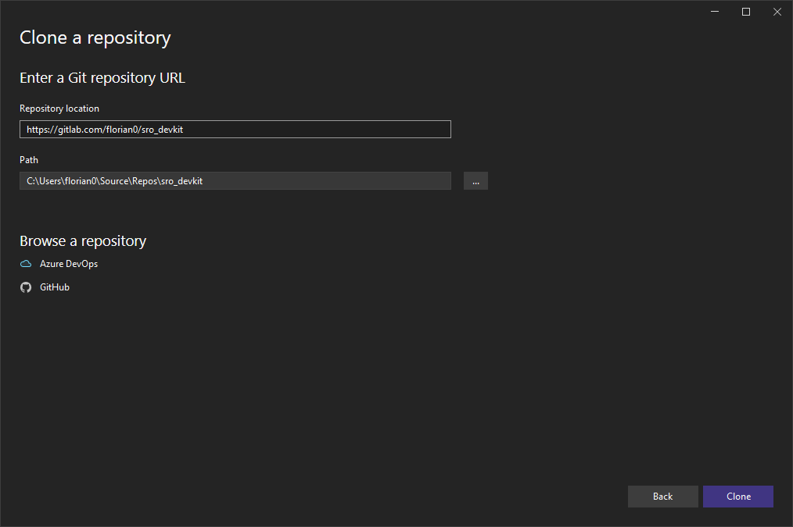
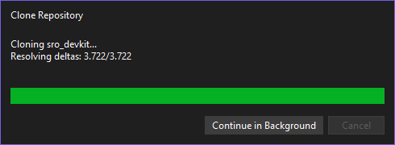
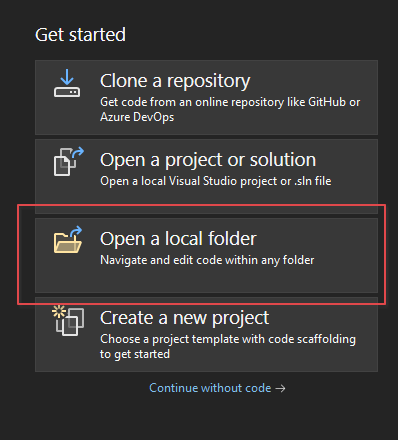
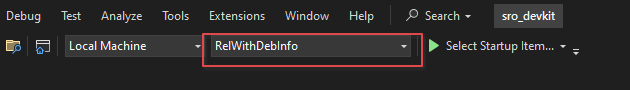
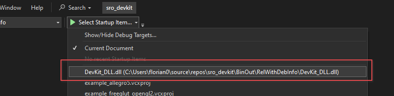
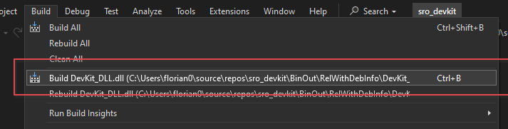

# Visual Studio 2022

This guide requires a CMake-capable Visual Studio, e. g. Visual Studio 2022.

## Prequisites

Follow [this guide](../../required-tools/visual-studio-2005/index.md) to install Visual Studio 2005.

## Install Visual Studio

Download the Community Version installer for 2022.

Select *Desktop development with C++* as workload. You may select other things if you like to do .NET or whatelse. Devkit only needs this one.

Wait until the setup is finished.

## Initially open the project

We want to directly download the project from Gitlab, so click on *Clone a repository*.

Enter the url of the repository (`https://gitlab.com/florian0/sro_devkit`). Pick a target folder you like. Then click clone.

Visual Studio will now download the source code and all dependencies.

## Open an existing project 

1. On the welcome screen, press Open a local folder.
   

2. Select Devkit Folder

3. Make sure that RelWithDebInfo is selected
   

4. Select DevKit_DLL as startup target
   

5. Click Build -> Build Devkit_DLL
   

