# Visual Studio Code

## Setup

1. Follow [this guide](../../required-tools/visual-studio-2005/index.md) to install Visual Studio 2005
2. Follow [this guide](../../required-tools/git/index.md) to install Git for Windows
3. Follow [this guide](../../required-tools/cmake/index.md) to install CMake
4. Follow [this guide](../../required-tools/ninja/index.md) to install Ninja build
5. Install VSCode

## Open project for the first time

### Clone from Git

1. Click on *Source Control*, then on *Clone Repository*.  
   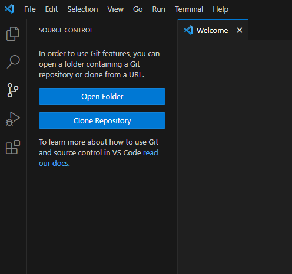

2. Enter `https://gitlab.com/florian0/sro_devkit.git` and press enter.  
   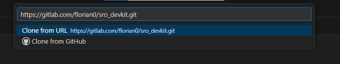

3. Pick a folder to save the project in.  
   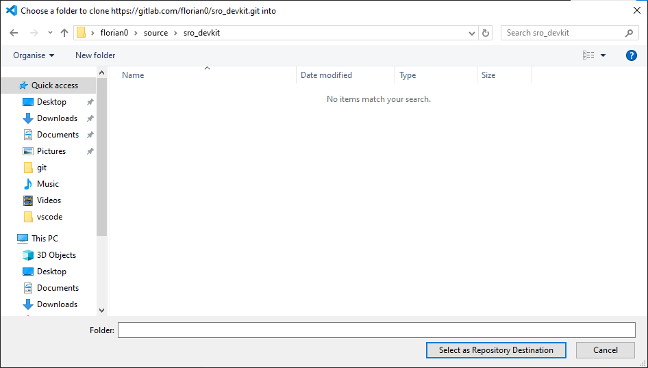

4. Wait for the cloning to complete
   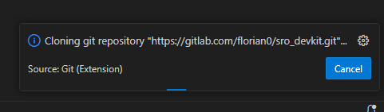

5. After it's done, click *Open*.  
   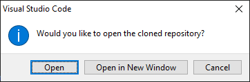

6. We need to checkout the submodules. Open a terminal.
   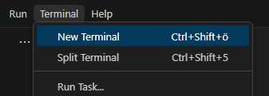

7. Enter `git submodule update --init`
   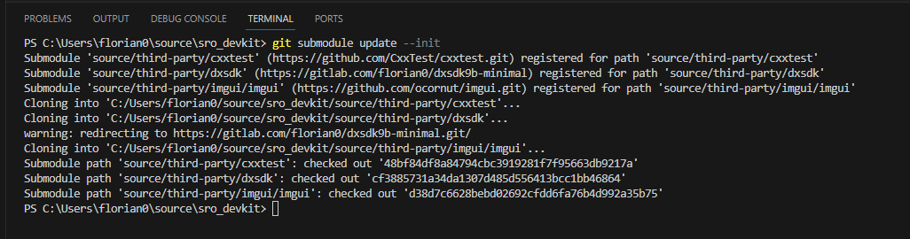

### Install recommended extensions

The project ships recommended extensions for VSCode. You can install them automatically. VSCode asks you in a notification.

1. Install recommended extensions (CMake & C++), VSCode should notify you if you don't have them. Just click *Install*.  
   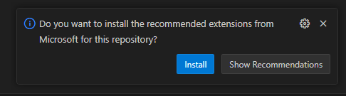 

2. The extensions manager will show that its doing its thing.  
   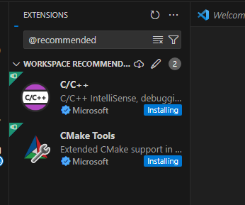 

3. When its done, it will look like this.  
   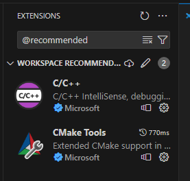

### Configure CMake

1. Press Ctrl+Shift+P to open the command window
2. Type `select configure preset`, select it and press enter
   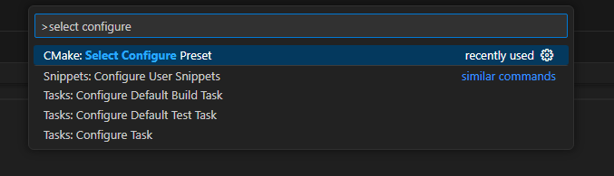

3. Select RelWithDebInfo-cfg
   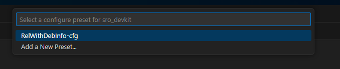

4. Wait until configuration is done (should only take a few seconds)

5. Open command window again

6. Type `build target`, select this entry, press enter
   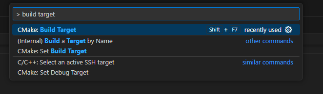

7. Select `DevKit_DLL`
   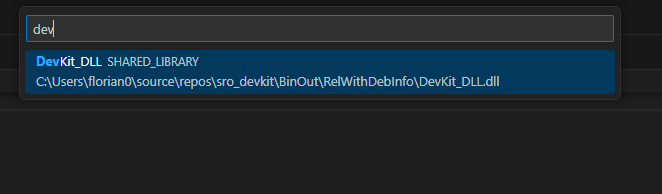

## Run and Debug

!!! important
    You must have a working game client in `BinOut/RelWithDebInfo/`. The client executable must load `DevKit_DLL.dll` as an imported dll or with LoadLibrary as the entry point. Just copy your whole game client to this folder.

1. Press Ctrl+Shift+P to open the command window
2. Type `debug` and select `Debug: Start Debugging`
   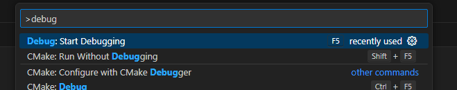
3. In case you get another selection menu, select `Run client`
